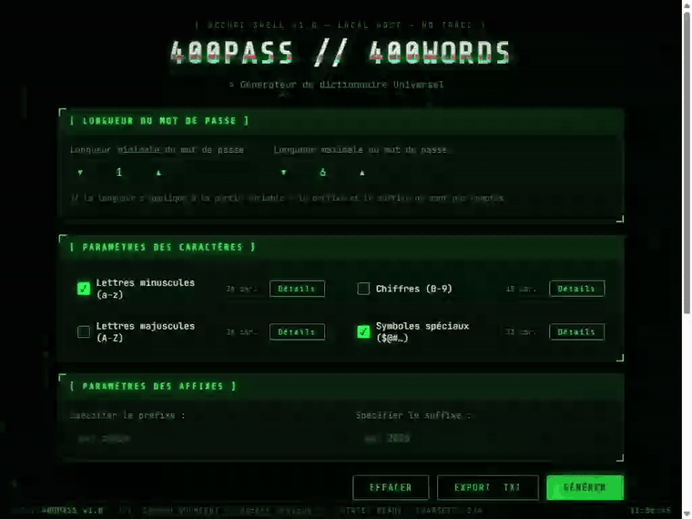

<div align="center">

# 🔐 400PASS // 400WORDS

**Générateur de dictionnaire universel — thème « terminal hacker »**

`un seul fichier HTML` · `100 % local` · `zéro dépendance` · `aucune installation`




`:génération en direct` · `grille de symboles` · `statistiques temps réel`

---

[](https://github.com/noumegniedmond237-sketch/400pass-wordlist-generator/raw/main/index.html)
[](https://github.com/noumegniedmond237-sketch/400pass-wordlist-generator/issues)

</div>

## ✨ Fonctionnalités

| | Fonctionnalité | Détail |
|---|---|---|
| 📏 | **Longueur variable** | Minimale / maximale de 1 à 32 caractères — le préfixe et le suffixe ne sont pas comptés |
| 🔣 | **Jeux de caractères** | Minuscules, majuscules, chiffres et **33 symboles spéciaux** (de `&` à `\`, `Espace` inclus — grille complète dans la démo ci-dessus) |
| 🎛️ | **Détails par jeu** | Grille de sélection **symbole par symbole**, synchronisée en direct avec le champ d'édition libre |
| 🔗 | **Préfixe & suffixe** | Ajoutés à chaque combinaison générée |
| ⚡ | **Aperçu animé** | 500 premières combinaisons avec effet de « décodage » dans un terminal néon |
| 🔢 | **Compteur géant** | Total et taille de fichier calculés en `BigInt` — affiche sans broncher **42 907 784 220** combinaisons |
| 💾 | **Export `.txt`** | Flux incrémental par lots, barre de progression, vitesse temps réel, bouton d'annulation, garde-fous mémoire |
| 🖥️ | **Thème hacker** | Pluie Matrix, titre glitché, scanlines et flicker CRT, glow néon |
| 📱 | **Responsive** | Mobile → desktop, raccourcis clavier (`Entrée` = générer, `Échap` = fermer) |

## 🚀 Démarrage rapide

1. **Télécharger** [`index.html`](https://github.com/noumegniedmond237-sketch/400pass-wordlist-generator/raw/main/index.html)
2. **Double-cliquer** dessus — l'application s'ouvre dans votre navigateur
3. Régler le masque, puis **`GÉNÉRER`** pour l'aperçu ou **`EXPORT .TXT`** pour la liste complète

> 💡 Les polices (*Share Tech Mono*, *JetBrains Mono*) se chargent en ligne ; hors connexion, le repli monospace du système prend le relais sans casser l'interface.

## 🎛️ Le masque de génération

L'interface reprend la logique des boîtes de dialogue de récupération de mot de passe : vous décrivez **ce dont vous vous souvenez**, l'outil énumère **toutes les combinaisons possibles** qui correspondent.

```
combinaison = préfixe + [partie variable de L caractères] + suffixe
                L ∈ [longueur minimale … longueur maximale]
                caractères ∈ somme des jeux sélectionnés
```

## 🛠️ Sous le capot

- HTML + CSS + JavaScript vanilla — **zéro framework, zéro build, zéro requête obligatoire**
- Énumération incrémentale type **compteur base-N** : les combinaisons sont produites à la volée par lots de 5 000, sans jamais saturer la mémoire
- Arithmétique `BigInt` pour les totaux et les tailles de fichiers (exactitude garantie au-delà de 10¹² lignes)
- Export par `Blob` avec rendu de main à l'interface entre chaque lot — la page reste fluide pendant l'écriture
- Pluie Matrix en `<canvas>` à cadence maîtrisée, respect de `prefers-reduced-motion`

## 📁 Structure

```
400pass-wordlist-generator/
├── index.html        # l'application complète (interface + logique)
├── assets/
│   └── demo.gif      # démonstration animée
└── README.md
```

## ⚠️ Avertissement légal

> Cet outil est destiné aux **tests de sécurité autorisés**, à la **récupération de vos propres mots de passe** et à l'apprentissage. Utiliser les dictionnaires générés contre un système sans autorisation explicite de son propriétaire est **illégal**.

## 🤝 Contribuer

Les idées et remontées de bugs sont bienvenues — ouvrez une [issue](https://github.com/noumegniedmond237-sketch/400pass-wordlist-generator/issues).

---

<div align="center">

**Développé par Edmond NOUMEGNI** `<< Hacker Éthique >>`

[](https://portfolio-nine-jade-22.vercel.app/)
[](https://github.com/noumegniedmond237-sketch)

⭐ N'hésitez pas à laisser une étoile si ce projet vous est utile !

</div>
